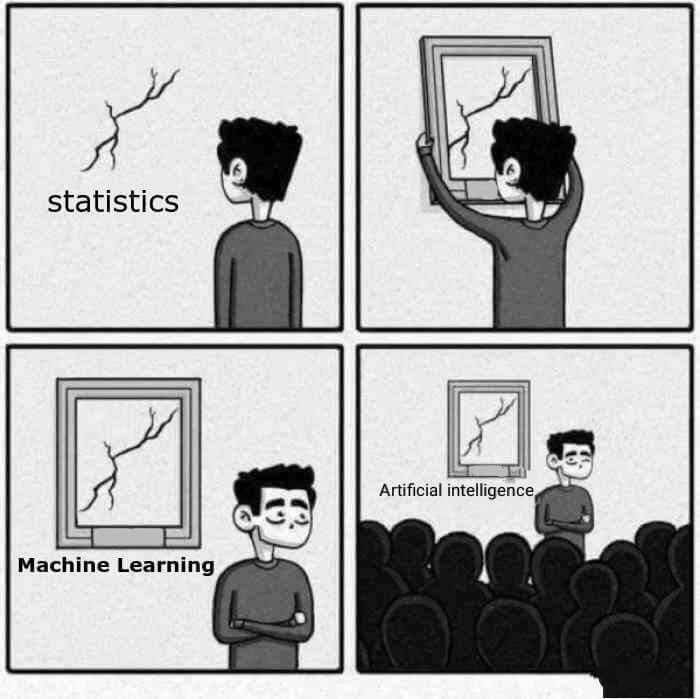
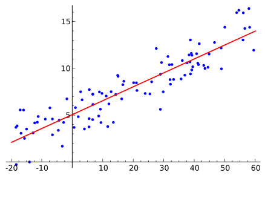
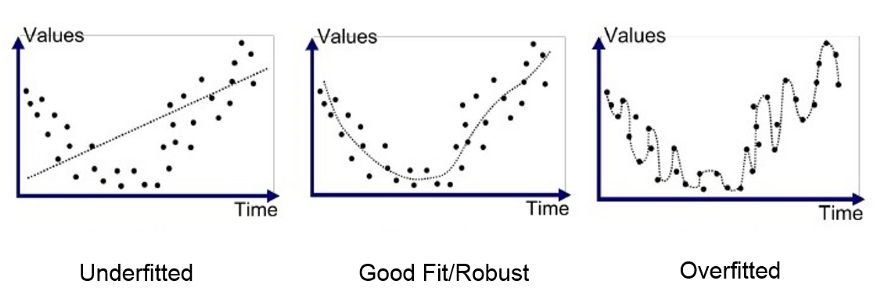
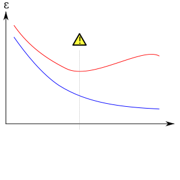
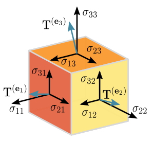
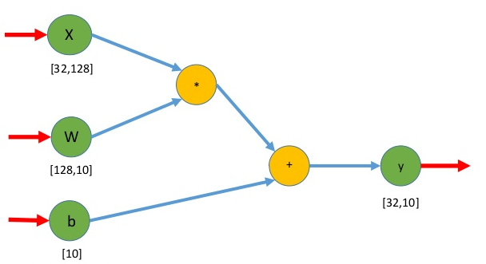

# Intro

## Things you already know

1. Interchangable Parts
1. Testing
1. Integration

## Objectives

1. Think about ML from an engineering perspective
1. Learn some of the terminology used to help converse between Data Scientists and Engineers like:

## ai vs statistics

::: notes

Some of this is merely reframing of terms you've already heard. From AI, ML, Data Science, drawing from Statistics, Linear Algebra
Larry described the evolution of terms from perceptrons, to neural networks, to deep learning. All these terms help to market these techniques.

:::

# you're going to need some data

---

## you need to know what you're trying to do

- look at your data (inputs and outputs)
- phone a friend
    - [scikit learn flow chart](http://scikit-learn.org/stable/tutorial/machine_learning_map/index.html)
    - or just use deep learning, it's cool
- interpretability

::: notes

I talk about "just use deep learning" in jest here, but every day there are
articles and papers of people trying problems previously thought to be best
approximated by more "traditional" ml methods.

Some industries require being able to explain, like your credit score.

:::

## don't forget to look for prior art
- Look at YOLO, UNet, ResNet51, RetinaNet, BERT, Transformer, and many other hyped algorithms.
- Tensorflow has many sets of "pre-trained" weights 

## this was a whole section on data prep
- new API
- new CSV from a customer

## things that matter for ML
- normalizing or "whitening"
- binning
- missing values
- dimensionality reduction
- class imbalance

# algorithms

---

## jargon

- letters
- $Y = mx + b$

## jargon (cont'd)

$Y = Wx + b$

## regression

## what if there are multiple variables?

- $y = W_1 x_1 + b$
- $y = W_1 x_1 + W_2 x_2 + \ldots + b$
- $y = Wx + b$

## overfitting

## overfitting

# inference aka "pushing to production"

## scaling (performance, speed)
- easy
- well defined interfaces
- shared-nothing
- load balancing

## model health
- what if incoming data is different than training data?
    - e.g., hot dog vs not hot dog, and someone gives it a brautwurst
    - or a real example, [kangaroos on self driving cars](https://www.theguardian.com/technology/2017/jul/01/volvo-admits-its-self-driving-cars-are-confused-by-kangaroos)

## Operations (checkups)
- get new data! prompt users for wrong responses
- online learning: re-train nightly/hourly/steaming w/ new data
- active learning: figure out what labels you need to improve model performance

# tensors and flow graph

## tensors

- linear relation between vectors, scalars, or other tensors
- practically: multi-dimensional array
- 

## computational flow graph (Directed-acyclic graph)

# questions?

# other resources

## other learning resources
::: nonincremental

- http://fast.ai
- https://hackernoon.com/choosing-the-right-machine-learning-algorithm-68126944ce1f
- http://ml-cheatsheet.readthedocs.io/en/latest/linear_regression.html

:::

## image credits

::: nonincremental
- [ai vs stats](https://twitter.com/phr999/status/1010146093600997376)
- [regression](https://en.wikipedia.org/wiki/Regression_analysis)
- [overfitting](https://medium.com/greyatom/what-is-underfitting-and-overfitting-in-machine-learning-and-how-to-deal-with-it-6803a989c76)
- [more overfitting](https://en.wikipedia.org/wiki/Overfitting)
- [loss functions](https://blog.algorithmia.com/introduction-to-loss-functions/)
- [gradient descent](https://www.experfy.com/blog/gradient-descent-algorithm-and-its-variants)
- [tensors](https://en.wikipedia.org/wiki/Tensor)
- [tensorflow graph](https://www.slideshare.net/alessiotonioni/tensorflow-intro-2017)
:::
